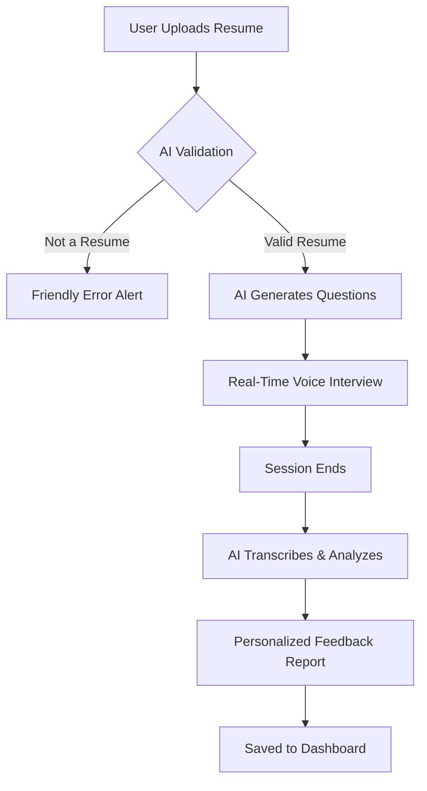

# 🔨 PrepStep — AI-Powered Mock Interviewer

**PrepStep** is a high-performance, voice-first AI platform designed to help job seekers nail their next interview. By combining instant resume parsing with real-time voice-to-voice interaction, PrepStep offers a realistic and low-stress environment for candidates to practice and refine their communication skills.

---

## 🚀 Key Features

### 📄 Intelligent Resume Parsing
*   **Gemini-Powered Extraction**: Uses Gemini (Flash 1.5/2.0) to instantly extract skills, education, and career history from PDF uploads.
*   **Integrity Gatekeeper**: Automatically validates if the uploaded document is a genuine resume/CV, rejecting recipes, technical metadata, or gibberish with friendly user feedback.
*   **Low-Barrier Entry**: Supports everything from professional executive CVs to a beginner's first resume draft.

### 🎙️ Real-Time Voice Interviewing
*   **Voice-to-Voice Interaction**: Seamless real-time conversation using the **Vapi AI** infrastructure.
*   **Realistic Latency**: Sub-500ms response times for a feedback loop that feels natural and lifelike.
*   **Context-Aware Questioning**: AI interviewers reference your specific job history and target company (e.g., Safaricom, Google) to ask tailored questions.

### 📊 Comprehensive Performance Reports
*   **STAR Method Alignment**: Feedback is categorized based on the Situation, Task, Action, and Result framework.
*   **Metric Breakdown**: Get scored on confidence, technical precision, clarity, and overall readiness.
*   **Suggested Answers**: See model answers for every question asked during the session to understand where you can improve.

### 💳 Tiered access & Payments
*   **Credit System**: New users start with 2 free interview credits.
*   **Clerk Authentication**: Secure login and session management.
*   **M-Pesa Integration**: Seamless local payment processing for "Pro" tier upgrades.

---

## 🏎️ Core Workflow



---

## 🛠️ Technology Stack

| Layer | Technology |
| :--- | :--- |
| **Framework** | [Next.js 15+](https://nextjs.org/) (App Router, Server Actions) |
| **Styling** | [Tailwind CSS 4](https://tailwindcss.com/) & [Framer Motion](https://www.framer.com/motion/) |
| **Authentication** | [Clerk](https://clerk.com/) |
| **AI (Logic)** | [Google Gemini 1.5 Flash](https://aistudio.google.com/) (Parsing & Feedback) |
| **AI (Voice)** | [Vapi SDK](https://vapi.ai/) |
| **Database** | [Prisma ORM](https://www.prisma.io/) with PostgreSQL |
| **Deployment** | [Vercel](https://vercel.com/) |

---

## 📂 Project Structure

```text
prepstep/
├── prisma/                 # Database schema and migrations
├── src/
│   ├── app/                # Next.js App Router (Pages & API Routes)
│   │   ├── api/            # API endpoints (Resume parsing, Feedback gen, User status)
│   │   ├── dashboard/      # User interview history
│   │   └── pricing/        # Subscription and payment UI
│   ├── components/         # Reusable UI components (Navbar, Upload, Interview Logic)
│   └── lib/                # Utility functions (Prisma client, Helper tools)
├── public/                 # Static assets
└── package.json            # Dependencies and scripts
```

---

## 🚦 Getting Started

### Prerequisites
*   Node.js (v18+)
*   PostgreSQL Database
*   API Keys: Clerk, Gemini (Google AI Studio), Vapi.

### Installation

1.  **Clone the repository**:
    ```bash
    git clone https://github.com/StephenSoloi/prepstep.git
    cd prepstep
    ```

2.  **Install dependencies**:
    ```bash
    npm install
    ```

3.  **Setup Environment Variables**:
    Create a `.env.local` file in the root directory:
    ```bash
    # Database
    DATABASE_URL="your_postgresql_url"
    DIRECT_URL="your_direct_postgresql_url"

    # Authentication
    NEXT_PUBLIC_CLERK_PUBLISHABLE_KEY=...
    CLERK_SECRET_KEY=...

    # AI
    GEMINI_API_KEY="your_google_ai_studio_key"
    VAPI_API_KEY="..."
    ```

4.  **Database Migration**:
    ```bash
    npx prisma generate
    npx prisma db push
    ```

5.  **Run Locally**:
    ```bash
    npm run dev
    ```

---

## 🔄 Recent Updates

### Gemini 1.5 Migration (March 2026)
*   Deprecated Groq/Llama in favor of **Gemini 1.5 Flash**.
*   Implemented **JSON Output Mode** for high-reliability parsing without regex cleaning.
*   Added **Intelligent Document Validation** to the `parse-resume` API to prevent non-resume uploads.
*   Modernized the **Error Alert UI** with responsive glassmorphism designs for mobile-first accessibility.

---

## 📜 License
This project is private and owned by Stephen Soloi. All rights reserved.
